# PICOhaven 2

**PICOhaven 2** is a tiny retro videogame: a card-based tactical RPG / dungeon crawler inspired by my love of the board game Gloomhaven* (and less directly, of other 2D tactical turn-based games such as the GBA Fire Emblem and Into The Breach). It's built on the delightful [PICO-8 fantasy console](https://www.lexaloffle.com/pico-8.php), which provides tight creative and scope constraints, such as a 128x128 pixel screen resolution, 16 preset colors, and only 32kB for code, graphics, and sound combined (a fraction of the size of even mobile games).

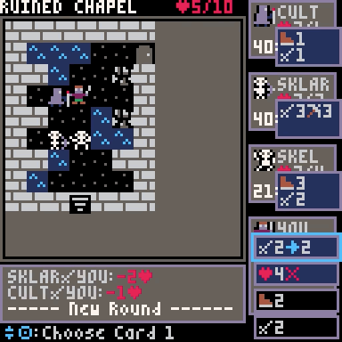

PICOhaven 2 adopts a modified & simplified version of the mechanics used in Gloomhaven, both to streamline solo play and to fit the platform constraints. It includes a campaign with 21 scenarios, 9 character levels with multiple upgrade paths, and various items that further modify gameplay and strategy. It's a sequel to the similar [PICOhaven](https://github.com/icegoat9/picohaven/blob/main/README.md) released in 2021.

*\*Note: This is just a free, solo-fan-made project and has no affiliation with Gloomhaven. If you like this type of game I recommend checking out the Gloomhaven family of board games for much more tactical depth from multi-character cooperative play!*

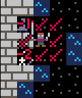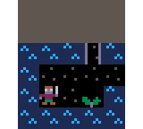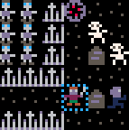

# Where to Play

The simplest option is on the web, on the PICO-8 BBS at: https://www.lexaloffle.com/bbs/?tid=54850 (the below How-To-Play is also posted there).

Alternately, you can download the below "cartridge image" picohaven2_###.p8.png and open it in the PICO-8 desktop application on Windows / Mac / Linux / Raspberry Pi, or load it onto a PICO-8 compatible retrogaming arcade or handheld such as the [Pimoroni Picade](https://shop.pimoroni.com/products/picade), [Gameforce](https://gameforce.fun/products/gameforce-handheld) or [Powkiddy RGB30](https://powkiddy.com/products/pre-sale-powkiddy-rgb30-rk3566-handheld-game-console-built-in-wifi).

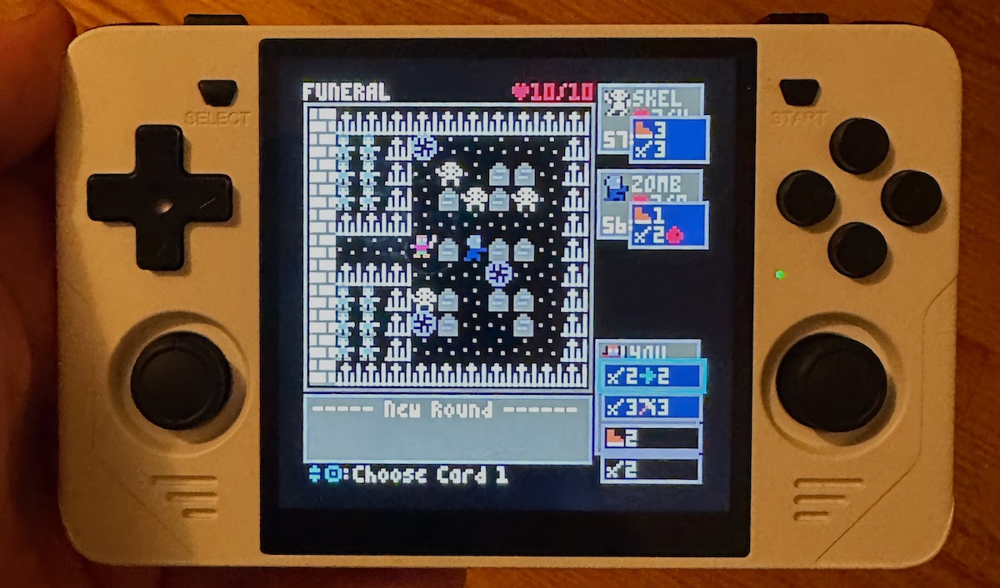

That's right, the entire game (code, graphics, sound, and data) is encoded as 32kB of data hidden inside the below 160x205 pixel image!

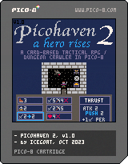

# How to Play / Rules

The controls for the game are the standard PICO-8 controls:

These depend on whether you're playing on a keyboard, in a mobile web browser, or on a retro handheld with physical buttons, but in general they are just the arrow keys / D-pad, the "O" button (mapped to the 'z' key on keyboards) as the main "select/action" button, and occasionally the "X" button ('x' key on keyboards) for "cancel/undo".

If you've previously played PICOhaven 1, the interface and rules are similar enough that you can jump right in!

As a general UI note: the game shows your possible actions and the relevant buttons in blue at the bottom of the screen.

## High-Level How-To-Play

Given the tight code size constraints, I was unable to fit a step by step tutorial/onramp mode into the game itself. So in retro style, below is a brief "game manual":

In Picohaven 2, you explore and fight your way through a series of scenarios / levels. In most of them, you need to defeat all enemies in all rooms (end your move on a doorway or arch to reveal the next room).

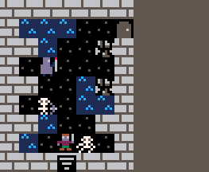

You start with a deck of 11 different action cards. Unlike some games, you do not randomly draw from it. Instead, you start with all 11 cards in hand, and each round you choose two of the cards in hand to play (which are then discarded).

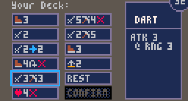

Each type of enemy also has a small deck of preset action cards they randomly draw from. Once the cards are chosen, the round begins and the character with the lowest *initiative* number on the card they selected goes first.

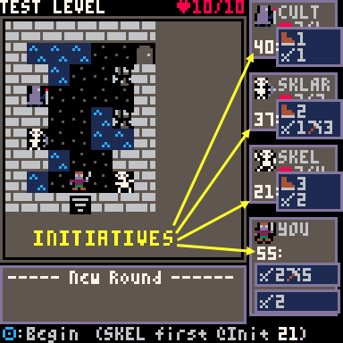

Each following round, you'll choose another two cards from your hand, so your choices become more limited. However, you can also use a card as a default "attack 2" or "move 2" action rather than what's printed on it, to give yourself some more flexibility.

Once you've finished enough rounds to play through your deck, you reshuffle your discarded cards and start again with a full hand of cards to choose from, with one exception: you randomly _**burn**_ one card each time you reshuffle, meaning it is not available for the rest of this scenario. Because of this, you only have a finite number of rounds to win a scenario before your deck runs out of cards and you become _**exhausted**_, meaning you return to town, heal up, and prepare to try again (note that all burned cards, used items, and lost health are restored after each scenario, success or failure, and you keep any gold or experience collected even if you fail a scenario and try again). 

You are also _**exhausted**_ if you are reduced to 0 health, except: if you still have cards in hand, you'll burn a random card from hand to dodge that killing blow and survive for another turn. Be warned: this reduces the number of rounds you have left until your deck runs out of cards, so you can't afford to do this too many times!

A few more powerful cards are _**burned**_ whenever you play them, so you can only use them once per scenario (though if you select them for your turn but use a default move 2 / attack 2 instead of playing them, they are just discarded instead of burned, and you'll have another chance to use them after your next reshuffle).

You'll see periodic (optional) treasure around the world, ranging from gold dropped by enemies to mysterious chests. You'll only collect this treasure if you make an effort to end your turn on it, or use a card with the "loot nearby squares" action-- any treasure that's not collected by the end of the scenario is lost. (Thematically, imagine there are additional cowardly enemies lurking on the edge of each skirmish: once you defeat the last enemy in a scenario, they scoop up any remaining treasure and flee):

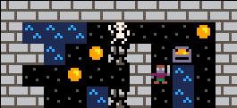

That summarizes the core gameplay. There are many additionl details you can probably learn as you play. However, if you want to know more now (or are coming back to this later after being confused about something in the game), read on...

## More Detailed How-To-Play / Tips

**Info Panels**

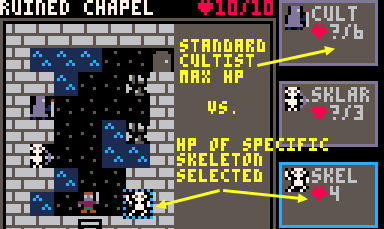
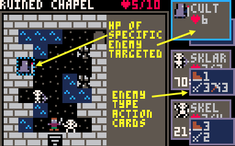

The "enemy info" on the right side of the screen typically shows the action card each enemy type has drawn for the turn, but if you move the selection cursor over a specific enemy (which you can do during the "beginning of round inspect map" phase, or when actively playing an attack), you can see the remaining health of that specific enemy.

Also note that if you are selecting cards from your hand for the turn and can't remember the map layout or how close an enemy is, you can press "X" to review the map (this is also noted in the standard action prompt at the bottom of the screen).

**Conditions and Buffs**

The Wound condition can be applied by certain attack cards or modifiers. It causes the afflicted character to lose 1HP at the end of every round. A "heal" action removes the wound condition in addition to healing as normal.

The Stun condition causes the afflicted character to skip their next turn. This may happen during the current round, or next round (if the stun is applied after the character has already acted this round).

If you or an enemy have the Shield condition (either innately or from playing a card), all incoming attacks have their damage reduced by that amount. This does not apply to damage sources other than attacks...

**Attack Modifier Cards**

Whenever you attack, you draw a random "attack modifier card" that increases or decreases the damage. This deck begins the game with a balance of + and - modifiers, most of them "-1", "+0", or "+1":

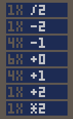

As you level-up through the game, you'll be able to remove some of these modifiers and replace them with more powerful ones that increase the values or even add conditions to them, swaying randomness in your favor and making even your initial deck of action cards more powerful...

**Message Log / Damage Animations**

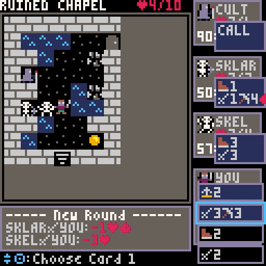

When you attack or are attacked, a red number indicating the actual damage dealt will briefly animate between attacker and target. If the number seems different than you expect, this may be because it includes any changes from attack modifier cards drawn and any Shield the target has-- the message log below the map gives you the full information. If the message log scrolls by too quickly, note that you can scroll back through it at the end of the turn to understand what happened.

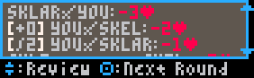

**Difficulty Levels**

Need an extra challenge, want to make it easier, or have you finished  the game and want to play it again with a different character build? You can adjust the difficulty in the town menu. Note that higher difficulty levels also increase the value of coins and chests...

**XP / Leveling Up**

You gain XP for winning scenarios, as well as for killing enemies and using burned cards, even if you fail the scenario. When you accrue enough to level up, you get to swap in one of two new cards to your deck, as well as upgrade your attack modifier deck (which starts the game evenly balanced with + and - modifiers).

**Long Rest action**

In the card selection screen, there is also a "REST" action. You generally don't _need_ to use this, as whenever your hand runs out of cards, you automatically reshuffle your deck and burn a random card.

But this "long rest" action gives you the benefit of choosing which card to burn and ensuring you shuffle redraw an important card you need for next turn, as well as providing a bit of healing and refreshing a few specific items.

## Strategy Tips

This isn't comprehensive, but a few tips if you're finding this challenging:

* Health is a precious resource: try to position yourself so that as few enemies as possible can hit you (since you can see what each enemy will be doing this round, if you move faster than them you may be able to end your turn just out of range of them, forcing them to waste their turn). Ranged attacks are also useful here.
* When you select your two cards from hand for the round, the one you select first sets your initiative for the round (see the cues in the UI). Going faster than enemies is often useful, but depending on your positioning you can also strategically use slow initiatives to let enemies come to you, and to let you hit them and then run out of range before the next round.
* Each enemy type has their own group of behaviors: fast vs. slow initiative, melee vs. ranged attacks, high vs. low movement, and a few have unique more dangerous abilities. You can use knowledge of them over time to prioritize which ones to tackle first or to stay away from.
* Enemies with shield reduce all your incoming _attacks_ by that amount. Strategies against these can include high-value attacks, or other sources of damage (which bypass shield values): traps, pushing into objects, wounds.
* It's possible to win the game with many different "builds" in terms of cards, upgrades, and items chosen, but some scenarios will be difficult if you remove too many of the move cards from your deck!

You can share your own strategy tips or ask for help in the comments section wherever you found this game (PICO8 BBS, Reddit, Itch, or so on)...

## How-To-Play Video

Maybe some day if people say it would be useful... but I don't expect that many people will even find this game...

## Notes for Gloomhaven players

Picohaven should feel conceptually familiar to you: there are many common mechanics, which leads to some similar tactical trade-offs.

However, there are a number of differences from the Gloomhaven game mechanics, some made in the interest of streamlining play (some choices are automated to reduce the number of user prompts), some made because I felt they led to better single-character gameplay or balance, and some made to simplify project scope / code size. As a Gloomhaven player you may come in with assumptions about mechanics for this game, so I'll list some main differences to be aware of:

* Cards each have only one action rather than a "top" and "bottom", though you can still use cards as a default Move 2 or Attack 2 once each per turn. This combination does make it easier to have double-move or double-attack turns, but cards and level designs are balanced around this.
* Stun and wound are the only conditions.
* There is no advantage/disadvantage, curse, bless, or muddle (so there's no drawback to using ranged attacks on adjacent targets).
* You still have an attack modifier deck, but enemies do not-- their damage is always what's shown on their action card for the turn.
* All pushing attacks cause damage on collision with an obstacle or another enemy (inspired by a few Cragheart cards in Gloomhaven)-- the cards explain how they work in-game.
* You will automatically burn a card to prevent fatal damage, but it is a random card from your hand (you cannot burn discarded cards to avoid damage).
* You will automatically short rest when you drop below two cards in hand (and cannot choose to take damage to lose a different card).
* You can choose to long rest, but must do it before you have fewer than two cards in hand (note: you can still long rest even if stunned)
* All items are passively used-- they either provide a passive bonus, or automatically trigger on damage or some other condition (some are one-time use and some are refreshed on long rest).
* When you open a door, that ends your move, but revealed enemies do not act until the next round.
* There are no battle goals, enhancements, prosperity, reputation, new character class unlocks, and so on.
* Enemy difficulty does _not_ automatically scale with your level (that was less important as this is a simpler, more linear, single-character campaign)
* The enemy movement AI is not exactly the same, though it still follows a deterministic algorithm where enemies try to move into range and then attack, and can move through or around their allies as needed. One notable difference: enemies do not see traps and do not try to navigate around them, to make it somewhat easier to use traps to your advantage.

Despite these differences, many key concepts and strategies from the Gloomhaven family of board games are relevant, including:
* Managing hand size, exhaustion, use of burn cards
* Upgrading your action and attack modifier decks over time
* Using tactical positioning and knowledge of enemy actions to avoid incoming damage
* Strategic use of both fast and slow initiatives
* Direct damage (traps, push) and wound vs. shielded enemies
* Balancing the value of collecting loot for optional item upgrades vs. the risk of failing a scenario outright if you spend too much time doing that

# Special Thanks

* To the small group of fans of PICOhaven 1 who left nice comments on it on the BBS or Reddit, such as "What an insane labor of love."
* To @nephilim, xcw, and seppo for playtesting or useful feedback on early versions of the game, which led to various UI changes and some new gameplay features
* To @gearfo and @hwd2002 who responded to my "call for remix / reinterpretations of PICOhaven 1 music". I ended up using a variant of @gearfo's composition as the music for PICOhaven 2 (I sadly ran out of space to include a major second theme song, as I ended up using 2/3 of the SFX memory to store binary game data...)
* And to the entire PICO8 community (on the BBS, Reddit, and Discord)-- what a helpful, supportive group.

# Source Code + Development Documentation

This entire game is about 1800 lines of PICO-8 flavored Lua, plus accompanying sprite, sound, and binary data (some data such as the story text is compressed and packed into unused nooks and crannies of the graphics and sound memory, for example).

In case it's useful to others trying to tackle a game of this type on PICO-8 (and honestly, mostly for myself in the future when I look back at this), I commented the source code and also put together some supporting documentation here: [picohaven2_source_doc.md](docs/picohaven2_source_doc.md)

I also posted some light devlog-ish updates on Mastodon (https://mastodon.gamedev.place/@icegoat) during development.

# Contact Info / Feedback

If you're one of the small number of people who finds this game and plays it (and the even smaller number who look through this README or the source code), I'd love to hear what you think. This was just a free labor-of-love project in my spare time over the past months.

You can reach me on Mastodon, as @icegoat on the [PICO8 BBS](https://www.lexaloffle.com/bbs/?tid=54850), @icegoat9 on reddit (TODO: add launch post link) and [Itch](https://icegoat9.itch.io/), and so on...