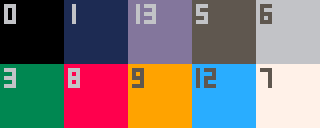
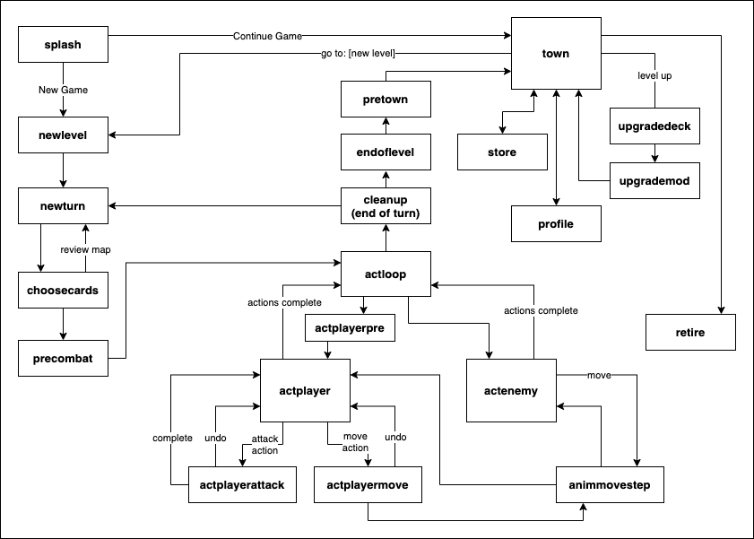
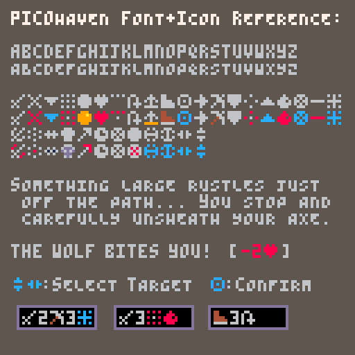

Developer notes to accompany the source code for [PICOhaven 2](../README.md), a tactical card-based turn-based dungeon crawler / light RPG built on the the [PICO-8](https://www.lexaloffle.com/pico-8.php) fantasy console.

This file is internal development notes, see the [README](../README.md) for more of a game overview including where and how to play it.

These are mostly notes-to-self, to make it easier to remember the big picture if I take a break from this project and come back to it months or years later (for example, for a sequel...). But perhaps they'll be useful to others who look into the source code. Fair warning-- I don't claim to be a software engineering expert, and I had to make many tradeoffs between code abstraction vs. pragmatically fitting features into the size constraints of the PICO-8 environment via narrow good-enough solutions.

PICOhaven 2 is a sequel to [PICOhaven](https://github.com/icegoat9/picohaven#readme), and adapts the same core "engine" built for that, with modest changes to add some new game features and strip out unused ones to make space.

# Development Workflow / Build + Run notes

The game source is primarily split between two files:
- `picohaven2.lua` -- main game code, about 1800 lines of PICO-8 flavored Lua, plus comments
- `picohaven2.p8` -- the game 'cart' which contains the sprites, map, and sfx (plus some game strings stored as binary in unused gfx/sfx space, via helper cart `storedatatocart.p8`...)

Typical development + test loop:
- Edit the source code in `picohaven2.lua` (using VScode or another external editor-- it's too large for the PICO-8 built-in editor to open because of its in-code comments, which I didn't want to remove)
- Whenever you want to run it, strip comments and reduce size with the third-party shrinko-8 tool, e.g.: `python3 ../shrinko8-main/shrinko8.py picohaven2.lua picohaven2_minified.lua --minify-safe-only`
- In the PICO-8 application, load and run `picohaven2.p8` (which includes the source from `picohaven2_minified.lua`). If a previous version is already open you can just hit Ctrl-R to reload changes (after running the minify command above), which gives a nice quick testing loop.
- Edit picohaven2.p8 in the PICO-8 IDE when needed to edit graphics, maps, sound, music
- Note: typing INFO at the PICO-8 commandline after a change will show token/character usage
- Periodically, lint the code to check for unused variables (potential wasted tokens!), unclear local/global variable declarations, and so on, with a command such as `python3 ../shrinko8-main/shrinko8.py --lint picohaven2.lua | less`

# Source code organization & overview

The source code itself has a table of contents for code organization, and moderately detailed in-code comments. 

In addition, some notes I refer back to during development:

## Color palette

The game uses a reduced palette of 10 colors (with minor exceptions for the player and final boss), a black/blue/purple/grey ramp and some accents:

| pico8# | color       | usage |
| - | --------- | --- |
| 0 | black | general use |
| 1 | dark blue | environment (water) |
| 13 | purple/grey | general use |
| 5 | dark grey | general use |
| 6 | light grey | text, obstacles, general use |
| 3 | dark green | environment (outdoor accents) |
| 8 | red | health, wound, attacks, warnings, elite enemy eyes, sprite highlights |
| 9 | orange | treasure |
| 12 | light blue | mostly reserved for UI elements / prompts. also used for "stun" and "push" |
| 7 | white | emphasized text |

## Sprite Flags

| flag# | meaning |
| - | - |
| 0 | *DEPRECATED, was: actor initialization during initlevel* |
| 1 | impassible (to move and LOS) |
| 2 | impassible move (unless jump), allows LOS |
| 3| animated scenery (default: 4 frames) |
| 4| triggers immediate action (trap, door) |
| 5| triggers EOT action (treasure) |
| 6| edge of room (unfog up to this border) |
| 7| is doorway (trigger door open at EOT) |

## Gameflow State Machine

Generally, the game uses a state machine to partition different gameplay (i.e. different update and draw behavior) into different functions, rather than one update function with many if statements or global variables that set behaviors. changestate() changes to a new state, calling its init function, which typically sets the new update and draw functions if needed.

(the above has not been updated to include pushing-related state transisions added late in development, but the ascii version in code has)

However, there's some overhead in coding a new state, especially if its behavior is very similar to other states or only used in one place, so some changing gameplay within states is controlled by global variables (see below for the many global variables that indicate for example whether the message box is in 'interactive scrolling mode', and so on).

## Global Variables Summary

Global variables and data structures are used liberally to avoid burdening every function call with extensive lists of parameters, given the strict code size limitations. To mitigate the risks of this, all other variables should be explicitly declared as local, and I keep a summary of global variables here to refer back to.

**debugging** (some removed near release to save tokens):
- `debugmode` (bool)
- `logmsgq` (bool)
- `godmode` (bool) -- for testing, boost the player in some way to make it easy to quickly beat levels and check unlocks / campaign progression. e.g. add a special 'SMITE' attack to hand that attacks all enemies within LOS, boost maxhp/xp/gold, etc  

**flow control and state related**:
- `state` -- current state
- `_updstate, _drwstate` -- current update/draw routines, different depending on state
- `prevstate, nextstate` -- used by a few functions or multi-purpose states, which need to return to a configurable state after finishing. a common usage would be `nextstate='newstate' / _drwstate=drawfoo / _updstate=waitforbutton` and waitforbutton() runs `changestate(nextstate)` on button press, reducing need to create a custom updatefn for each state whose only purpose is waiting for a button press to advance
- ~~`_updprev` -- previous _updstate function: used to store an _updstate to return to after executing a specialized _upd function that it's not worth creating a whole new state and changestate() action to represent (for example for msgq review)~~
- `initfn[]` -- array of init functions to run when changing to [state]
- `msgq` -- queue of strings to display in msgbox (max length ~22 chars/line depending on char width)

**gameplay / level related**:
- `dlvl` -- dungeon level
- `doorsleft` -- doors left to open in level, part of check for end of level
- `fog[]` -- 11x11 array with either '1' (fog of war) or 'false' (unfogged)
- `gppercoin` -- scales with difficulty
- `trapdmg`
- `mapmsg` -- message to show in map area (at beginning and end of level), typically the story text
- `pretxt[], fintxt[]` -- pre- and post-level story text to display (stored in unused sprite/sfx memory by a separate cart storedatatocart6.p8 and retrieved during runtime using extractcartdata(), to save ~8k characters)
- `tutorialmode` -- determines whether to display additional messages and tips, automatically on for the first few levels
- `difficulty`
- `difficparams[]` -- sets HP and gold scaling per level, etc

**Special wincons, event triggers**:
- `herbs` -- # of herbs collected or used in a level (special level-specific goals)
- `wongame` -- trigger "retire" option in town

**animation-related**:
(the .ox/.sox approach to animation is based on the system seen in Lazy Dev Academy's Roguelike YouTube videos)
- `animt` -- animation timer: set to 0 to initiate animation-only updates that increment animt, until animt=1 
- `.sox, .soy` -- the starting location (in pixels) of an object we're animating the motion of
- `.ox, .oy` -- the current during-animation display offset (in pixels) of an object we're animating the motion of. when animt=1, .ox,.oy should have decreased to zero, as the object should be displayed at its final location.
- `fram` -- increments every cycle through program
- `afram` -- animation frame, cycles from 0->3 repeatedly
- `animtd` -- increments  of animt from 0-1  during animation (lower increment = slower animations)
- `shake` -- how many pixels to shake the map area by each frame, used for specialized animations (0 = no shaking)
- `screenwipe` -- ranges from 0 (no wipe) to 63 (initiative wipe)
- `msg_td` -- scroll msg every # frames
- `act_td` -- update actor anims every # frames

**UI selection related**:
- `selx, sely, seln` -- x, y, and n positions of selection cursor within a list (`seln` = position in a 2D list)
- `selvalid` -- true = current selection is valid (mostly used to check valid move and attack targets for player), changes how cursor is drawn
- `showmapsel` -- true = show selection cursor on map (typically paired with the update() function calling selxy_udpate_clamped() to update selx, sely)

**cards and deck-related**
- `pdeck` -- player deck of cards (each element a `crd[]` data structure)
- `pdecksize` -- size of player deck (always 11 in this game, but abstracted out in code for potential changes in sequels)
- `tpdeck` -- version of pdeck with virtual "rest" card appended, for choosecards()
- `longrestcrd` -- pointer to long rest card in master deck
- `pdeckmaster[]` -- all potential player deck cards, combining the starting pdeck (the first `pdecksize` entries) and future upgrade options (2 upgrade cards per level)
- `crdplayed` -- globally saved link to card currently being played by player, so that we can provide an option to undo an action and restore card/deck state before it's completed
  - `crdplayedpos` -- where in the player's card selection UI this played card was (#1-#4), to allow smooth insertion back into that list in case of undo

**Card data structures**. Enemy cards may only have the .init and .act fields
- `card.init` = initiative value
- `card.act` = short string that encodes its action (e.g. `█2➡️3∧` = "attack 2 at range 3 and wound")
  - `descact[]` is a lookup table that maps █ to attack, for example
- `card.status` = 0 = in hand, 1 = discarded, 2 = burned
- `card.name` = e.g. "hurl sword"

**crd, the "parsed individual card actions" structure**. 
For example, from the sample `█2➡️3∧` card above:
- `crd.act, crd.val` -- action and value, e.g. `█,2` for "attack 2" 
- `crd.mod, crd.modval` -- 2nd param and value, e.g. `➡️,3` for "range 3"
- `crd.rng` -- attack range (if any), 1 for melee
- `crd.stun, crd.wound` -- if card inflicts that condition
- `crd.burn` -- if burned after use (player only)
- `crd.push` -- if non-nil, contains the distance an attack pushes (only player push actions are implemented, currently)
- `crd.aoe` -- to indicate one of various Area-of-Effect patterns is applied to the attack (only one simple pattern is implemented, but PICOhaven2 now implements that pattern for ranged AoE as well)
- `crd.special` -- for special player or enemy actions that don't fit the above and have custom code for handling them, e.g. "call" (summon), "rest", "howl" etc

**`actor[]` data structures**:
the below are all properties of form `actor[n].foo` e.g. `actor[n].crds`, often used with alias `a=actor[n]` to access them as `a.hp`, etc.
Note that `actor[1]` is initialized to = `p` (the player data structure, with similar fields)
- `spr` -- first sprite frame (and the following 3 are used for a 4-frame animation)
- ~~`bigspr` -- player only: index of a 16x16 profile sprite~~
- `x, y` -- locations (in map tiles, 0-10)
- `hp, maxhp`
- `lvl, xp, gold` -- **update**: these properties are only relevant for the player actor, so to save a few tokens as code space hit the limit late in development, they've been pulled out of the actor data structure and turned into standalone globals `p_lvl, p_xp, p_gp` (accessing a global p_lvl consumes fewer of PICO-8's previous code 'tokens' than a property p.lvl)
- `shld` -- shield value (0 if no shield)
- `pshld` -- persistent shield (restored each round)
- `stun, wound` -- true/false (or often, true/nil) statuses
- `crds` -- list of cards (card data structure above) to play or choose from this turn. for enemies, 1-2 entries. for player, can be 1, 2, or 4.
- `crd` -- card currently being acted on (in the "crd parsed individual card actions structure" noted above)
- `init` -- current turn initiative
- `crdi` -- index of card within a.crds[] to play next. only used for enemies, to keep track of position in a list of cards to play.
- `type` -- for enemies, links back to a row in the `enemytypes[]` data structure which includes their action deck, etc (since only one action card is drawn for each enemy type: all enemies of a given type take the same action each turn)
- `actionsleft` -- for player, # of actions they can still take this turn (starts at 2, decrements)
- `noanim` -- property of actors[] that don't have frames to animate through
- `obj` -- indicates actor is an 'objective' that should not thematically or for balance drop gold on defeat (e.g. gravestone)
- `ephem` -- property of actors[] which are ephemeral visual indicators that should only exist for the current animation cycle and then be deleted (attack / damage animations)

**enemytype[] data structure**:
- `enemytype.crds, .crd, .init` -- redundant with above? **TBD**

**Town and upgrades related** (misc):
- `townmsg` -- message to show in town
- `townlst[]` -- list of in-town menu options (dynamically generated)
- `upgradelists` -- global used by two different upgrade routines (action deck and modified deck) to pass list of lists to a draw function, so they can share the same draw function
- `pmodupgradesmaster` -- modifier deck upgrades available, combining the starting set (the first `pmodupgradessize` of these) and 1 more per levelup

**Turn sequencing** (tracking active actor, action, etc):
- `ilist[], initi` -- list of `{initiative, actor#}` pairs for all actors this turn, sorted in initiative order. `initi` is the index of the row within this list currently acting
- `actorn` -- index for actor[] of the active actor (during turn execution, read from sorted-by-initiative list of actors in ilist)
- See also actor.crds, .crdi, .init, and similar above in the actor data structure notes

**Push-related**:
Adding in a pushing attack late in development broke some earlier engine assumptions-- for example that movement is being done by the current global actor #`actorn`. It was easiest to reuse existing code with the help of a few new globals to handle this special case:
- `apushed` -- the actor currently being pushed (nil if no actor is being pushed). Used to tell routines such as animmovestep() which usually move the "active actor" that a different actor should be moved instead.
- `pushdmg` -- the amount of pushed-into-object collision damage to apply to an actor once a push is complete. Stored in a global because this is calculated at time of push, but isn't applied until after the push animation is complete and we've checked to see if the actor has already been removed (for example by being pushed over a trap).
- `apushedinto` -- if a first actor was pushed into a second actor, that second actor is stored in this variable (as a reference to the data structure member of actor[], not the index # into that array). This allows us to apply pushdmg to this actor as well, but only after the push animation and any trap triggers have been resolved

**Other**:
- `mvq` -- list (queue) of adjacent squares the current actor is moving through, starting at current position, in format `{{x=x0,y=y0},{x=x1,y=y1},...}`. Used to move and animate an actor through a path, checking for triggers (traps, doors, etc) at each step, and also for externally-forced moves such as pushes
- `dirx[], diry[]` -- save tokens for common x/y +-1 offsets
- `restburnmsg` -- message describing which card was burned for a "long rest" (chosen during choosecards() but not displayed until player action)
- `lastlevelwon` -- used to enable a "review story" feature to read the post-level text from the last level played if you accidentally skip by it, or after resuming a save game
- `saveversion` -- savegame version, for futureproofing if save format changes
- ~~`avatars, avatar` -- selection of name, small sprite, and large sprite (for profile) for player to provide a few color options~~ *deprecated to save tokens*

**Major game content DBs loaded from strings** (some also listed in sections above):
- `lvls[]` -- all non-map data for each level (name, reward for completion, which other levels it unlocks, and so on). Generated by writing out level info an external spreadsheet which compiles them into one long string to be split.
- `pretxt[], fintxt[]` -- pre- and post-level text to display (stored in unused sprite/sfx memory by a separate cart storedatatocart5 and retrieved during runtime using decode5...(), to save ~7k characters of code space and compressed size)
- `enemytype[]` -- list of enemy properties for each type (name, hp, innate shield, and so on)
- `edecks[]` -- list of potential action cards per enemy, indexed using `enemytype.name` or `actor.name` as key
- `pdeckmaster[]` -- all potential player deck cards (of the `card[]` data structure above), combining the starting pdeck (the first `pdecksize` entries) and future upgrade options (2 upgrade cards per level)
- `pmoddeck` -- initial player modifier deck drawn on each attack (+1 dmg, -1 dmg, and so on)
- `pmodupgradesmaster` -- mod upgrades available, combining the starting set (the first `pmodupgradessize`) and 1 more per levelup
- `storemaster[], store[], pitems[]` -- similarly: master list of all items in game, items currently in store, and items owned by player

**Persistent data (save/load)**:
- `dindx` -- auto-incrementing index into the 256-byte section of persistent memory used for savegames, allowing set/get functions to not pass an address with every call

**UI layout related** (many of them constants, to avoid hard-coding a lot of numbers and make tweaks simpler):
- `msg_x0` -- x offset added to message box (0 for normal location)
- `msg_w` -- width of message box
- `msg_yd` -- pixel-level scrolling offset of msgbox
- `map_w` -- width of map including border (also typically of message box)
- `hud_x0` -- x0 of HUD column
- `hud_py` -- actor box on HUD: y pos
- `hud_ey` -- enemy HUD y pos and spacing (at 0, hud_ey, hud_ey*2, etc) 
- ~~`ehudn[]` -- array of "enemy heads-up-displays" -- info cards for up to three enemy types".~~ *no longer global, turned into local in drawheadsup().
- ~~`gc_fg, gc_bg, gc_bg2, gc_sel` --  four global colors used (especially gc_bg = background color for e.g. profile and card selection screens, and gc_sel = selection box color)~~ *deprecated, hard-coded once I iterated on design and selected them, to save tokens*
- ~~`minispr` -- maps special characters to sprites to display instead (in printmspr()), e.g. Shift-A special character = "attack" option, also see `sh()` and the Sprite "font" notes below~~ *deprecated once we moved to a custom font for these icons*

**Campaign Stats related**
- `camp_gold` -- gold collected over campaign
- `camp_kills` -- enemies killed over campaign
- `camp_time` -- time elapsed in all levels (time not tracked when in town or start menu) over campaign, in units of 5 seconds (rolls over at ~50 hours playtime?)
- `camp_wins` -- number of times player has won the campaign on this device (persists across new games unlike all other saved game values)
- `levelstarttime` -- time() current level started
- `mindifficulty` -- minimum difficulty played at (beyond the intro level)

## Custom Icon Font + Action Encoding
A custom font is drawn in external cart ph2fontgen.p8, converted to a binary string, and poked into memory at runtime. This font also encodes various icons as extended characters (rather than as sprites as in PICOhaven 1, which took more code+tokens to draw in-line with text):

Some of these are placed at locations in the ASCII table that makes them easier to remember during development, such that Shift + a mnemonic letter in the PICO-8 editor produces this character:
- [A]ttack, [M]ove, [H]eart, [G]old, [J]ump, [R]ange, a[O]e
- [S]hield, [W]ound, [B]urn, [Z]stun (zzz...), [L]oot, [P]ush, ~~[i]tem~~

For example, if you press shift-j in the PICO-8 editor, it displays the character "웃", PICO-8's internal code representation of ASCII character 137. This is used in our code to symbolize "jump", and our custom font displays the leaping arrow icon shown above (8th icon) when printing this.

This is not only relevant to display: the behavior of most cards is defined directly by their text representation: the card `"█2➡️5"` is interpreted at run time as "attack 2 at range 5".

Note: mnemonics only go so far and then you've used the whole common alphabet-- there are others icons (such as various special items and UI elements) that do not have any handy mnemonic encoding, and are stored in the hiragana area of PICO-8's font for lack of a better place. For example, `え` in this custom font is the icon for the great mail armor. These are just tracked in code and in a design spreadsheet.

- `fontsub[]` -- lookup table used to rewrite certain characters on the fly during printing to screen. Sometimes just used to set an automatic color (e.g. replace all instances of `"♥"` with `"\f8♥"` to draw heart icon in red regardless of surrounding text color, without having to remember to do that every time we print a heart), sometimes used to layer two font characters in contrasting colors on top of each other (how the two-color icons shown above are embedded in a custom font). For example printing the move character `"😐"` actually prints `"\f6😐\-a\f4♪"` which prints the two pieces of the boot icon (each stored as a different custom-font character) overlaid in different colors.

## Enemy and Player cards-to-play global data structures
- `p.crds` (array of 4 playable full cards, init and all)
- `a.crds` or `a.type.crds`: list of enemy cards (two redundant values)
- `p.crd`, `a.crd`: parsed data struct (.act,.val,.stun, etc) for card currently being played
- `p.init` : initiative
- `a.init` or `a.type.init` (conceptually redundant-- could do code cleanup to deprecate use of one of these)

# Miscellaneous Other Notes

## Token / resource usage

During development I regularly ran into resource limits (tokens, characters, compressed size) and had to restructure code or data. Keeping some notes here about resource usage (more in notebook)

### token inventory of PICOhaven2

Total resource usage vs. PICO-8 platform limits, without minification: 
- `8295 / 8192 tokens`
- `~130,000 / 65,535 characters` -- far over limit
- `~30,000 / 15,616 compressed bytes` -- far over limit

After simple minification (stripping whitespace and comments). Unlike PICOhaven 1, this is still not small enough to load into PICO8, even for development: 
- `8295 / 8192 tokens`
- `49,668 / 65,535 characters`
- `17,889 / 15,616 (115%) compressed bytes`

v0.9 just before release, after aggressive minification with the shrinko-8 tool (stripping whitespace and comments, but also replacing most variables with cryptic 1-2 character names, combining code onto long lines, and some other unknown tricks-- no longer very readable which is why I maintain the original commented source):
- `8192 / 8192 tokens` (whew!)
- `36,030 / 65,535 characters`
- `15,040 / 15,616 (96%) compressed bytes`

## Rough Dev Log / History

I also posted a few running notes and screenshots on Mastodon at: https://mastodon.gamedev.place/@icegoat

| version | date | estimated hours | notes |
| --- | --- | --- | --- |
| PICOhaven v1.0e | 2021-Aug to Oct | 150-200 | Original PICOhaven game, through release + a few minor revisions based on player feedback. |
| v1.1 | 2022-Aug | 10 | Refactor under the hood using new pico8 "custom fonts" feature, partly to improve UI, partly to free up space for a potential v2 some day... |
| PICOhaven2 begins | 2023-Summer |  | Got more inspired with ideas for a sequel-- doodling story + mechanics concepts in a notebook |
| v0.1 | 2023-Aug | 20 | Specific concept crystallized, built rough barely-playable prototype of new mechanics (push, AoE), items, enemies. |
| v0.6 | 2023-Sep | 50 | Ongoing iteration on mechanics, UI, game content. Self-playtesting, revision, feedback from a few alpha playtesters. In the deep mud of "I think it's 90% done" for a while, but kept finding an area for improvement or room to squeeze in a tiny new feature. Kept hitting PICO8 code size limits so lots of "how do I shave 10 tokens off this code?" optimization puzzles which are fun in their own way. Taking breaks to work on tools (data compression, savegame editor, font tester) for variety. |
| v0.7 | 2023-Oct | 20 | "Almost done", working on repeated playthroughs to tweak enemy / level / upgrade balance, find bugs, etc. |
| v1.0 | 2023-Oct | 30 | Squeezed in a few more improvements, bonus content, and bugfixes. Music and sfx. Manuals and documentation. Released! |
| v1.0b | 2023-Nov |  | Bugfix release. Upload to Itch including standalone binaries for Win/Mac/Linux. Update this documentation and upload to a public Github repo. |
| v1.0c | 2025-Jan | 1 | Fix typo in story text, make 'easier' mode even easier. |

So I'd estimate I spent 100-150 hours on PICOhaven 2, on and off over the course of three months. Part of this time was just playing through the campaign over and over for testing and to iterate on level and card designs, which even the Nth time I still found fun, so it wasn't really Work-- turns out I'm partly just making the kind of game I want to play...

Looking at miscellaneous github stats from my private repo, I made about 200 commits over this period, and modified about 1/3 of the codebase / "engine" from PICOhaven 1 (~600 of the 1800 non-comment lines added, removed, or changed from the PICOhaven 1 code). That doesn't include all the new game *content* (graphics, level design, enemy abilities, cards, story, and so on).